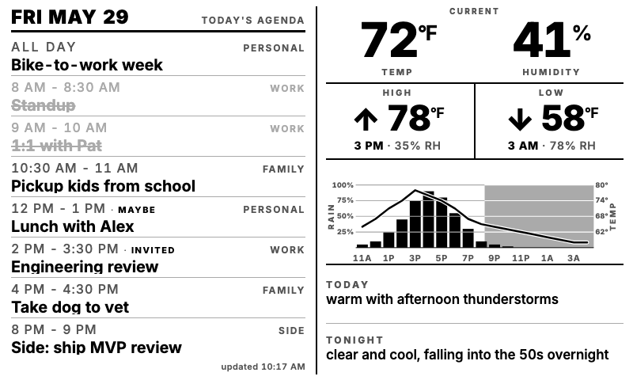

# trmnldash

A renderer for [TRMNL](https://usetrmnl.com/) e-ink dashboards. One container
hosts any number of dashboards on independent schedules, each composed of one
or more panels rendered into a device-specific PNG and served over HTTP for
TRMNL's Image Display plugin to poll.

Three panels ship today, composable in any combination via YAML:

- **`weather_landscape`** — 1872×1404 4-bit greyscale weather dashboard for
  the [TRMNL X 10.3"](https://shop.trmnl.com/products/trmnl-x). Hourly
  temperature curve overlaid on precipitation-probability bars, OUTSIDE /
  INSIDE / TEMP FORECAST cards, today/tonight prose, optional Home Assistant
  indoor + outdoor sensor readings.
- **`calendar_agenda`** — 400×480 portrait panel showing the day's events
  from one or more Google Calendars (OAuth, read-only). Density-tiered
  font sizing so sparse days breathe and full days compact, past events
  grey + strikethrough, `INVITED` / `MAYBE` badges on un-responded events.
- **`weather_compact`** — 400×480 portrait weather panel for half of a
  [TRMNL OG](https://usetrmnl.com/) (800×480, 2-bit grey). Current
  temp + humidity, today's high / low with times + RH, a single shared
  chart carrying rain % and temperature on the same grid lines, night
  shading, today/tonight prose.

Two ready-made dashboards are documented in
[`config.example.yaml`](config.example.yaml) (a single `weather_landscape`
for a TRMNL X) and [`config.og.example.yaml`](config.og.example.yaml) (an
`hstack` of `calendar_agenda` + `weather_compact` for a TRMNL OG mounted
landscape).

| TRMNL X (`weather_landscape`) | TRMNL OG (`calendar_agenda` + `weather_compact`) |
|---|---|
|  |  |

## Quickstart (Docker)

```bash
git clone https://github.com/fisherevans/trmnldash
cd trmnldash
cp config.example.yaml config.yaml             # edit lat/lon + secret_path
cp .env.example .env                            # add HA_TOKEN if using HA
cp docker-compose.example.yml docker-compose.yml
docker compose up -d
```

Each dashboard is served at
`http://<host>:8090/<dashboard.serve.secret_path>/dashboard.png`. Point
the TRMNL device's Image Display plugin at that URL and you're done.

Images are published to `ghcr.io/fisherevans/trmnldash`. Pin to a
versioned tag (`v1.4.0`) for stable deploys; use `:edge` to track `main`.
If you fork, point your own `docker-compose.yml` at your GHCR namespace and
let your own workflow publish the image.

## TRMNL refresh cadence

The server re-renders once per minute (configurable via `render.refresh_minutes`
in `config.yaml`). What the device displays is gated by how often *it* polls
the URL, which depends on your TRMNL plan:

| Plan | Image Display minimum refresh | Worst-case staleness |
|---|---|---|
| Free | 60 min | ~60 min |
| [TRMNL+](https://help.trmnl.com/en/articles/11861887-trmnl-faq) ($5/mo/device, sometimes bundled free with new hardware) | 5 min | ~5 min |

The 60-min cap on the Image Display plugin specifically (not the 15-min
TRMNL-wide default) is a server-side constraint TRMNL imposes for free-tier
resource budgeting; nothing on this end can override it. If real-time freshness
matters, TRMNL+ is the lever — the server's 1-min render cadence already feeds
a 5-min device poll comfortably.

If you don't need sub-hour freshness, bump `render.refresh_minutes` up to 30
or 60 to save the host a few percent of CPU and a small fraction of the
weather API's free-tier quota — nothing the device sees will change.

## Configuration

Everything's in one `config.yaml`. See
[`config.example.yaml`](config.example.yaml) for the documented schema. Secrets
(HA token, optional weather API key) stay in env vars referenced by name —
keep real values in `.env`.

```bash
# Sanity-check a config before deploying
uv run trmnldash validate --config config.yaml
```

Config structure: the top-level `dashboards:` list holds one or more
dashboard entries; each entry has a `name`, a `dashboard:` block
(device + layout), a `render:` block (output path + refresh cadence),
and a `serve:` block (per-dashboard `secret_path`). The top-level
`serve:` block defines the shared host/port that hosts every
dashboard's PNG. Each dashboard runs on its own scheduler at its own
`render.refresh_minutes`, so a 1-minute weather dash can sit alongside
a 10-minute calendar dash in the same container.

A few knobs worth calling out (under each dashboard's
`dashboard.layout.config:` for the weather panels):

- `weather.provider` — `open-meteo` (default, no key) or `nws` (US only,
  no key, richer prose via `shortForecast`).
- `weather.forecast_provider` — `derive` (default, composes TODAY/TONIGHT
  prose from hourly numerics) or `nws` (uses NWS's `shortForecast` strings
  directly). The two are orthogonal — `open-meteo` hourly + `nws` prose is
  a valid combo.
- `summary_side` (landscape panel only) — `left` (default) or `right`.
  Mirrors the layout horizontally.
- `climate` — per-season temperature → feel-word bands used in the
  forecast prose. Defaults to a Burlington, VT-style temperate New England
  calibration where 30°F in February reads as "chilly"; override the
  winter/summer/shoulder lists for hotter or colder climates.

Each dashboard's `render.refresh_minutes` — `1` is the most aggressive
cadence the host CPU can comfortably hold; bump up to 30/60 if you don't
need sub-hour freshness.

## Weather providers

| Provider | Key required | Coverage | Status |
|---|---|---|---|
| `open-meteo` | none | global | implemented, default |
| `nws` | none | US only | implemented |

Both implement the same `WeatherSource` protocol — switching is one line of
YAML (`weather.provider: nws`). Open-Meteo is the default because it needs
no signup; non-commercial use gets 10k calls/day, well above what a 10-minute
render cadence consumes. Adding a third provider is a single new module
under `src/trmnldash/sources/` + a clause in
[`sources/factory.py`](src/trmnldash/sources/factory.py).

## Home Assistant integration

The dashboard prefers HA sensor readings over the weather API for anything
HA can measure directly:

- **outdoor temp/humidity** — HA when configured, API current observation as
  fallback. The HA sensor is the actual reading at your location; the API
  is a model estimate from 1–30 km away.
- **indoor temp/humidity** — HA only. The API can't measure indoors. List
  several sensors and the dashboard averages them.

```yaml
home_assistant:
  base_url: http://homeassistant.local:8123
  token_env: HA_TOKEN
  sensors:
    outdoor_temp_f: sensor.outdoor_temperature       # single = use as-is
    outdoor_humidity: sensor.outdoor_humidity
    indoor_temp_f:                                    # list = mean
      - sensor.living_room_temp
      - sensor.bedroom_temp
      - sensor.office_temp
    indoor_humidity:
      - sensor.living_room_humidity
      - sensor.bedroom_humidity
```

Every field is optional. A missing or `unavailable` sensor just falls through
to the next fallback; the dashboard never fails because one entity is down.

Create a long-lived access token at `<your-ha-url>/profile/security` and
put it in `.env` as `HA_TOKEN=...` (or whatever name you put in `token_env`).

## Local development

```bash
# Setup (one time) — installs chromium for playwright
uv run trmnldash setup

# Render a static fixture (no API, no HA — useful for UI iteration)
uv run trmnldash render --data data-morning.json --out morning.png

# Render once with live data
uv run trmnldash render-live --config config.yaml

# Run the full service locally (scheduler + HTTP server)
uv run trmnldash serve --config config.yaml
```

`uv run` builds + installs into an ephemeral env on first invocation —
no `pip install` step needed.

The dashboard is one Jinja2 template
([`src/trmnldash/panels/weather_landscape/template.html`](src/trmnldash/panels/weather_landscape/template.html))
with all CSS inline. No build step, no bundler. Edits go directly there.

## Repo layout

```
src/trmnldash/
├── cli.py                   trmnldash {render,render-live,serve,setup,validate}
├── config.py                top-level YAML schema (dashboards list + shared serve)
├── engine/                  panel-agnostic rendering plumbing
│   ├── render.py            html -> chromium -> PIL.Image
│   ├── quantize.py          palette-driven snap to device greys
│   ├── layout.py            DeviceProfile + PanelSlot/VStack/HStack types
│   ├── panel.py             Panel manifest + name-based lookup
│   ├── compose.py           walk layout, paste panels, draw separators
│   ├── pipeline.py          dashboard orchestrator (fetch -> compose -> save)
│   └── server.py            scheduler + aiohttp HTTP server
├── panels/
│   └── weather_landscape/   the 1872x1404 full-screen weather panel
│       ├── __init__.py      exports `PANEL` (the manifest)
│       ├── config.py        panel's pydantic schema
│       ├── render.py        Jinja context + chart math + render_to_image
│       ├── live.py          fetch weather + HA, hand off to aggregate
│       ├── aggregate.py     merge weather + HA into render context
│       ├── bg_shading.py    density-shifted chart bg SVG fills
│       ├── template.html    single Jinja2 template, inline CSS
│       └── assets/
│           ├── bg-{cloud,rain,snow}.svg
│           └── makin-grey/  58 condition icons
└── sources/
    ├── config.py            WeatherConfig, HomeAssistantConfig, etc.
    ├── base.py              WeatherSource Protocol + NormalizedForecast
    ├── openmeteo.py
    ├── nws.py
    ├── homeassistant.py
    └── factory.py

scripts/                     one-off generators (PEP 723 single-file uv scripts)
data*.json                   dev fixtures for offline rendering
config.example.yaml          documented config schema
Dockerfile                   multi-stage; published to ghcr.io
docker-compose.example.yml   deploy shape
```

## Contributing

See [CONTRIBUTING.md](CONTRIBUTING.md). Issues and PRs welcome.

## Licenses

- Code: [MIT](LICENSE).
- Weather icons under `src/trmnldash/panels/weather_landscape/assets/makin-grey/`: MIT,
  [Makin-Things/weather-icons](https://github.com/Makin-Things/weather-icons).
