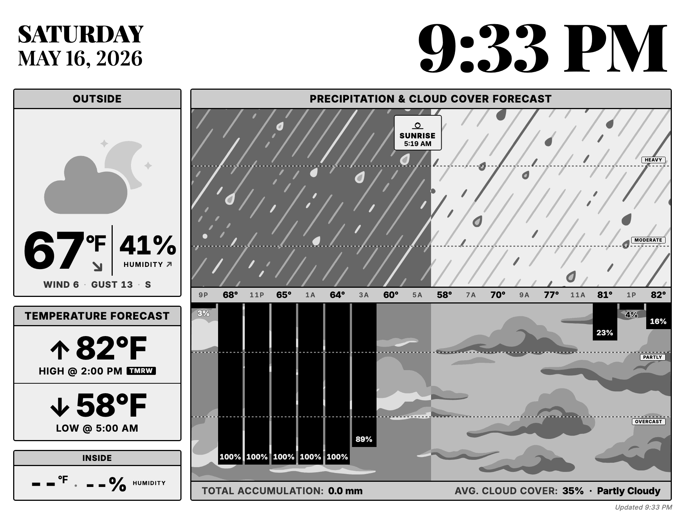

# trmnl-weather-dash

A weather dashboard for the [TRMNL X](https://shop.trmnl.com/products/trmnl-x)
10.3" e-ink panel. Pulls hourly forecast from a public weather API, prefers
real Home Assistant sensor readings when available, renders a native-resolution
1872×1404 4-bit grayscale PNG, and serves it over HTTP for TRMNL's Image
Display plugin to poll.



What's on the panel:

- **OUTSIDE** — current condition icon, temperature + 3-hour trend arrow,
  humidity + trend, wind/gust/direction.
- **TEMPERATURE FORECAST** — next 24h high/low with a `TMRW` pill if the
  peak/trough falls on the next calendar day.
- **INSIDE** — average of your configured indoor HA sensors; renders `--`
  when nothing's configured.
- **PRECIPITATION & CLOUD COVER FORECAST** — back-to-back bar chart. Rain
  bars grow up; cloud bars grow down. Dotted threshold lines mark
  MODERATE/HEAVY rain and PARTLY/OVERCAST cloud cover. The night half of
  the chart is shaded with a parallel night-tinted background pattern so
  the texture continues into evening hours. Sunset/sunrise markers float
  at their actual times.
- A small `Updated HH:MM` stamp in the bottom right tells you at a glance
  if the image is stale.

## Quickstart (Docker)

```bash
git clone https://github.com/fisherevans/trmnl-weather-dash
cd trmnl-weather-dash
cp config.example.yaml config.yaml             # edit for your location + sensors
cp .env.example .env                            # add HA_TOKEN
cp docker-compose.example.yml docker-compose.yml
docker compose up -d
```

The dashboard is served at `http://<host>:8090/<secret_path>/dashboard.png`.
Point a TRMNL Image Display plugin at that URL and you're done.

Images are published to `ghcr.io/fisherevans/trmnl-weather-dash`. Pin to a
versioned tag (`v0.1.0`) for stable deploys; use `:edge` to track `main`.

## TRMNL refresh cadence

The server re-renders once per minute (configurable via `render.refresh_minutes`
in `config.yaml`). What the device displays is gated by how often *it* polls
the URL, which depends on your TRMNL plan:

| Plan | Image Display minimum refresh | Worst-case staleness |
|---|---|---|
| Free | 60 min | ~60 min |
| [TRMNL+](https://help.trmnl.com/en/articles/11861887-trmnl-faq) ($5/mo/device, sometimes bundled free with new hardware) | 5 min | ~5 min |

The 60-min cap on the Image Display plugin specifically (not the 15-min
TRMNL-wide default) is a server-side constraint TRMNL imposes for free-tier
resource budgeting; nothing on this end can override it. If real-time freshness
matters, TRMNL+ is the lever — the server's 1-min render cadence already feeds
a 5-min device poll comfortably.

If you don't need sub-hour freshness, bump `render.refresh_minutes` up to 30
or 60 to save the host a few percent of CPU and a small fraction of the
weather API's free-tier quota — nothing the device sees will change.

## Configuration

Everything's in one `config.yaml`. See
[`config.example.yaml`](config.example.yaml) for the documented schema. Secrets
(HA token, optional weather API key) stay in env vars referenced by name —
keep real values in `.env`.

```bash
# Sanity-check a config before deploying
uv run trmnldash validate --config config.yaml
```

Config structure: the top-level `dashboard:` block describes the target
device + a layout tree composing one or more panels. The weather
landscape panel's settings (location, weather provider, HA sensors) live
inside the panel's `config:` block. The `render:` and `serve:` blocks
configure the scheduler and HTTP server.

A few knobs worth calling out (under `dashboard.layout.config:` for the
weather panel):

- `weather.provider` — `open-meteo` (default, no key) or `nws` (US only, no
  key, richer prose via `shortForecast`).
- `weather.forecast_provider` — `derive` (default, composes TODAY/TONIGHT
  prose from hourly numerics) or `nws` (uses NWS's `shortForecast` strings
  directly). The two are orthogonal — `open-meteo` hourly + `nws` prose is a
  valid combo.
- `summary_side` — `left` (default) or `right`. Mirrors the layout
  horizontally: chart card on the left, date + OUTSIDE + TEMP FORECAST +
  INSIDE stack on the right.

Top-level `render.refresh_minutes` — `1` is the most aggressive cadence
the host CPU can comfortably hold; bump up to 30/60 if you don't need
sub-hour freshness.

## Weather providers

| Provider | Key required | Coverage | Status |
|---|---|---|---|
| `open-meteo` | none | global | default |
| `nws` | none | US only | tracked in [#11](https://github.com/fisherevans/trmnl-weather-dash/issues/11) |
| `pirate` | yes (free) | global | tracked in [#12](https://github.com/fisherevans/trmnl-weather-dash/issues/12) |

All implement the same `WeatherSource` protocol — switching is one line of
YAML (`weather.provider: nws`). Open-Meteo is the default because it needs
no signup; non-commercial use gets 10k calls/day, well above what a 10-minute
render cadence consumes.

## Home Assistant integration

The dashboard prefers HA sensor readings over the weather API for anything
HA can measure directly:

- **outdoor temp/humidity** — HA when configured, API current observation as
  fallback. The HA sensor is the actual reading at your location; the API
  is a model estimate from 1–30 km away.
- **indoor temp/humidity** — HA only. The API can't measure indoors. List
  several sensors and the dashboard averages them.

```yaml
home_assistant:
  base_url: http://homeassistant.local:8123
  token_env: HA_TOKEN
  sensors:
    outdoor_temp_f: sensor.outdoor_temperature       # single = use as-is
    outdoor_humidity: sensor.outdoor_humidity
    indoor_temp_f:                                    # list = mean
      - sensor.living_room_temp
      - sensor.bedroom_temp
      - sensor.office_temp
    indoor_humidity:
      - sensor.living_room_humidity
      - sensor.bedroom_humidity
```

Every field is optional. A missing or `unavailable` sensor just falls through
to the next fallback; the dashboard never fails because one entity is down.

Create a long-lived access token at `<your-ha-url>/profile/security` and
put it in `.env` as `HA_TOKEN=...` (or whatever name you put in `token_env`).

## Local development

```bash
# Setup (one time) — installs chromium for playwright
uv run trmnldash setup

# Render a static fixture (no API, no HA — useful for UI iteration)
uv run trmnldash render --data data-morning.json --out morning.png

# Render once with live data
uv run trmnldash render-live --config config.yaml

# Run the full service locally (scheduler + HTTP server)
uv run trmnldash serve --config config.yaml
```

`uv run` builds + installs into an ephemeral env on first invocation —
no `pip install` step needed.

The dashboard is one Jinja2 template
([`src/trmnldash/panels/weather_landscape/template.html`](src/trmnldash/panels/weather_landscape/template.html))
with all CSS inline. No build step, no bundler. Edits go directly there.

## Repo layout

```
src/trmnldash/
├── cli.py                   trmnldash {render,render-live,serve,setup,validate}
├── config.py                top-level YAML schema (dashboard / render / serve)
├── engine/                  panel-agnostic rendering plumbing
│   ├── render.py            html -> chromium -> PIL.Image
│   ├── quantize.py          palette-driven snap to device greys
│   ├── layout.py            DeviceProfile + PanelSlot/VStack/HStack types
│   ├── panel.py             Panel manifest + name-based lookup
│   ├── compose.py           walk layout, paste panels, draw separators
│   ├── pipeline.py          dashboard orchestrator (fetch -> compose -> save)
│   └── server.py            scheduler + aiohttp HTTP server
├── panels/
│   └── weather_landscape/   the 1872x1404 full-screen weather panel
│       ├── __init__.py      exports `PANEL` (the manifest)
│       ├── config.py        panel's pydantic schema
│       ├── render.py        Jinja context + chart math + render_to_image
│       ├── live.py          fetch weather + HA, hand off to aggregate
│       ├── aggregate.py     merge weather + HA into render context
│       ├── bg_shading.py    density-shifted chart bg SVG fills
│       ├── template.html    single Jinja2 template, inline CSS
│       └── assets/
│           ├── bg-{cloud,rain,snow}.svg
│           └── makin-grey/  58 condition icons
└── sources/
    ├── config.py            WeatherConfig, HomeAssistantConfig, etc.
    ├── base.py              WeatherSource Protocol + NormalizedForecast
    ├── openmeteo.py
    ├── nws.py
    ├── homeassistant.py
    └── factory.py

scripts/                     one-off generators (PEP 723 single-file uv scripts)
data*.json                   dev fixtures for offline rendering
config.example.yaml          documented config schema
Dockerfile                   multi-stage; published to ghcr.io
docker-compose.example.yml   deploy shape
```

## Contributing

See [CONTRIBUTING.md](CONTRIBUTING.md). Issues and PRs welcome.

## Licenses

- Code: [MIT](LICENSE).
- Weather icons under `src/trmnldash/panels/weather_landscape/assets/makin-grey/`: MIT,
  [Makin-Things/weather-icons](https://github.com/Makin-Things/weather-icons).
